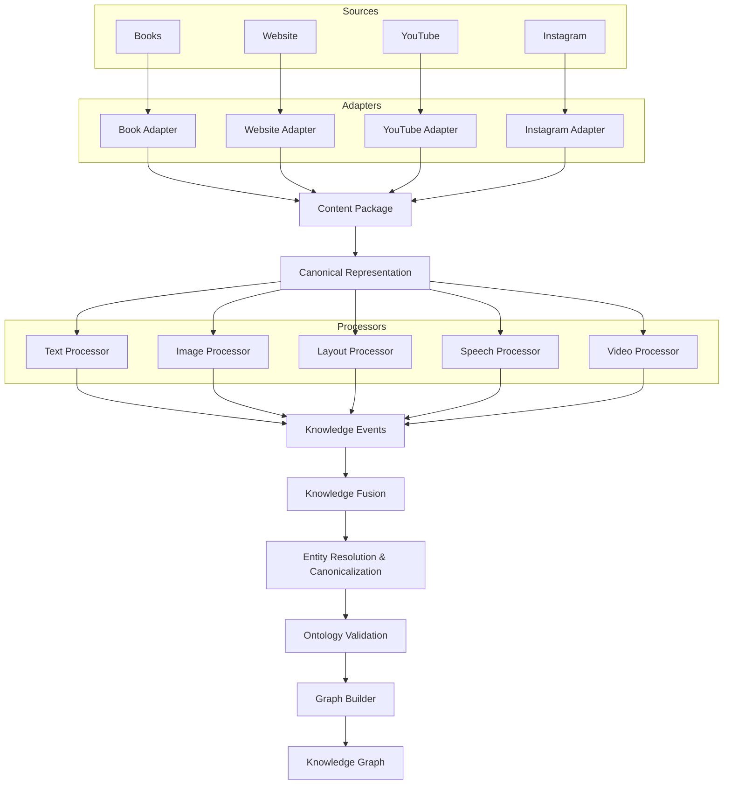
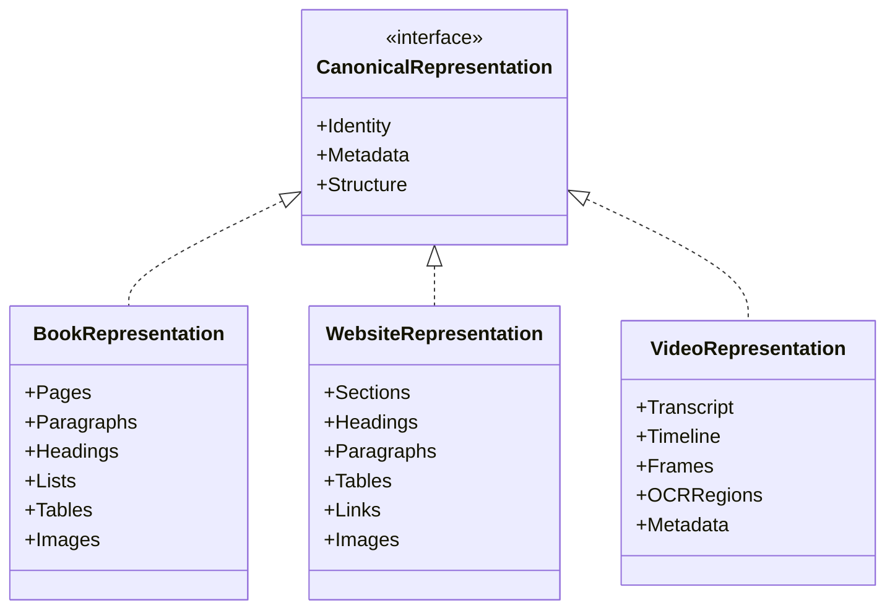
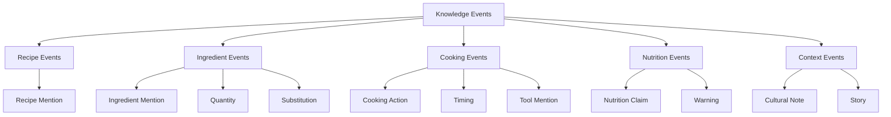
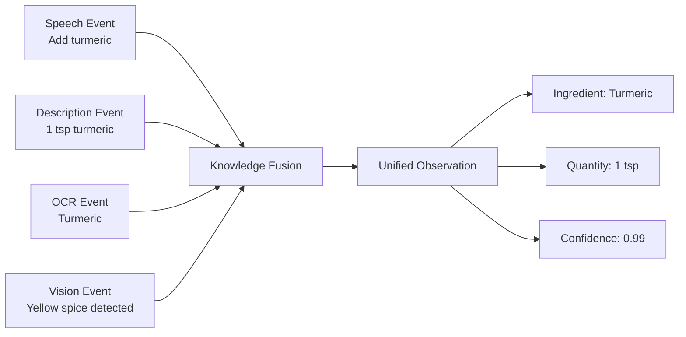
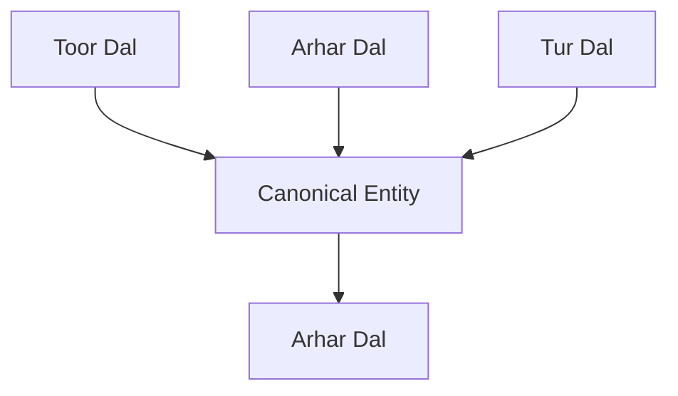
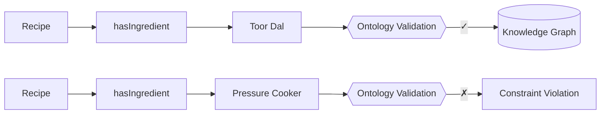
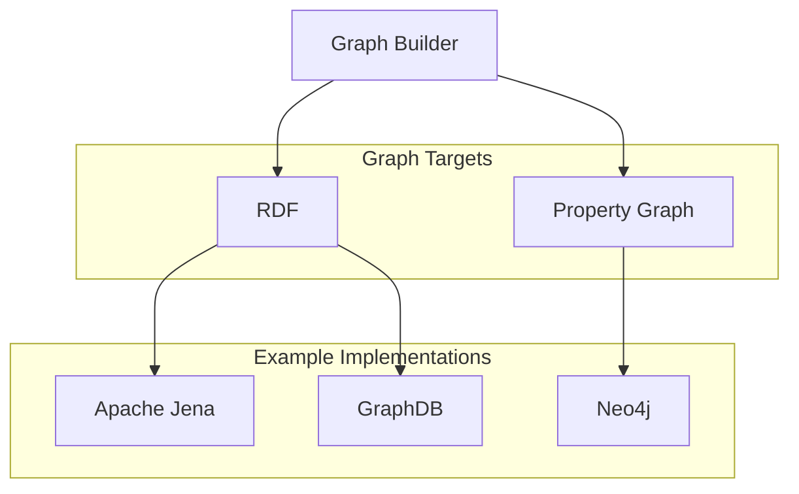

# Multimodal Knowledge Acquisition Framework

**Version:** v0.2  
**Author:** Atul Prakash  
**Status:** Research Design Draft

---

# Vision

Design a **general-purpose Multimodal Knowledge Acquisition Framework** capable of acquiring structured knowledge from heterogeneous multimodal sources and constructing a Knowledge Graph.

> Food is the **application domain**, while the architecture should remain reusable for other domains.

---

# Design Principles

The framework should satisfy the following principles:

- Modular
- Extensible
- Source Independent
- Modality Independent
- Explainable
- Provenance Aware
- Reusable
- Plug-and-Play

> Adding support for a new source should **not** require changing the downstream pipeline.

---

# High-Level Pipeline



---

# 1. Source

A Source is where information originates.

Examples

- Book
- PDF
- Website
- YouTube
- Instagram
- Facebook
- Audio Recording
- Research Paper

A Source represents **where content is obtained**, not the content itself.

---

# 2. Source Adapter

A Source Adapter converts a particular source into a common exchange object.

Examples

- Book Adapter
- Website Adapter
- YouTube Adapter
- Instagram Adapter

Each adapter hides source-specific implementation details.

---

# 3. Content Package

The Content Package is the standard exchange object produced by every Source Adapter.

It represents the collected content in a source-independent manner.

## Responsibilities

- Store collected artifacts
- Store provenance
- Store available modalities
- Store source metadata
- Store relationships

## Non-responsibilities

The Content Package never performs information extraction.

It never stores semantic knowledge.

It is immutable.

---

## Content Package Schema

| Component | Description |
|------------|-------------|
| Identity | Unique package identifier |
| Provenance | Source, URL, retrieval date, author |
| Artifacts | PDF, HTML, Images, Audio, Video |
| Modalities | Text, Image, Audio, Video, Tables, Layout |
| Relationships | External references and links |

---

# 4. Canonical Representation

The Canonical Representation converts raw artifacts into structured representations suitable for downstream processing.



The Canonical Representation abstracts away source-specific formats while preserving document structure.

---

# 5. Modality Processors

Each processor specializes in a single modality.

Examples

- Text Processor
- Layout Processor
- Image Processor
- Speech Processor
- Video Processor

Processors never communicate directly with each other.

Each processor independently produces Knowledge Events.

---

# 6. Information Extraction

Information Extraction converts Canonical Representations into semantic observations.

Typical tasks include

- Named Entity Recognition
- Relation Extraction
- Event Extraction
- Entity Linking
- Coreference Resolution

---

# 7. Knowledge Events

Knowledge Events represent atomic semantic observations extracted from one modality.



```json
{
    "event_type":"IngredientMention",
    "source":"Book",
    "location":{
        "page":12
    },
    "confidence":0.96,
    "payload":{
        "ingredient":"Toor Dal",
        "quantity":"1 cup"
    }
}
```

Knowledge Events are **observations**, not graph facts.

One Knowledge Event may generate multiple graph facts.

Multiple Knowledge Events may support a single graph fact.

---

# 8. Knowledge Fusion

Knowledge Fusion combines semantically equivalent Knowledge Events originating from multiple modalities and multiple sources.

Fusion performs

- Evidence aggregation
- Conflict detection
- Confidence aggregation
- Event grouping

Fusion computes **global confidence** using multiple observations.

Example



---

# 9. Entity Resolution & Canonicalization

Different sources may refer to the same real-world entity using different names.

Example



This stage creates canonical identifiers before graph construction.

---

# 10. Ontology Validation

Candidate facts are validated against the domain ontology.

Examples



Ontology validation ensures semantic consistency before graph construction.

---

# 11. Graph Builder

Graph Builder converts validated knowledge into the target graph representation.



Changing graph technology should not affect upstream components.

---

# 12. Knowledge Graph

The Knowledge Graph stores validated domain knowledge together with provenance and supporting evidence.

Graph nodes and relationships should remain traceable back to their originating Knowledge Events.

---
