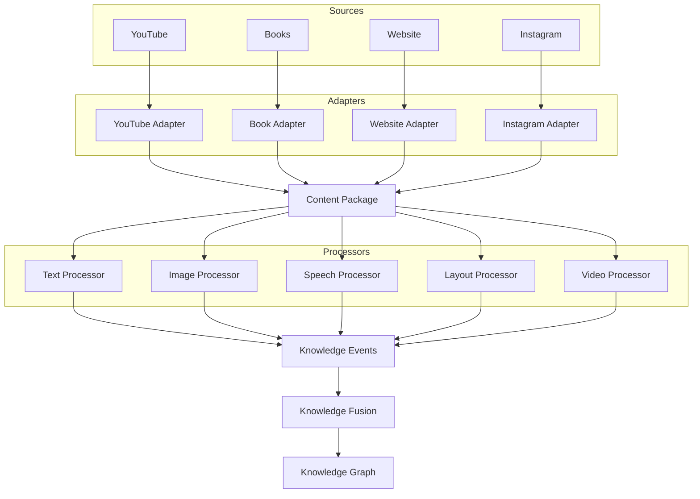
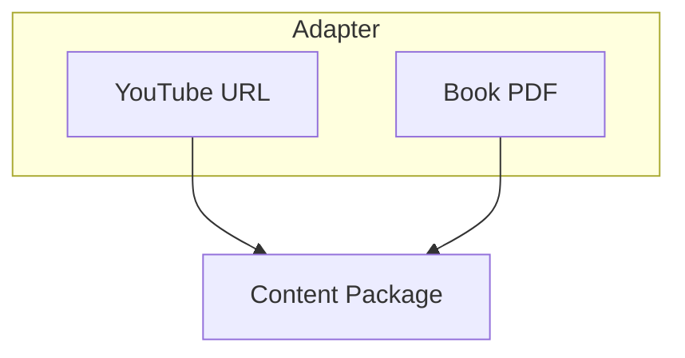
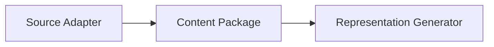

# Multimodal Knowledge Acquisition Pipeline for Food Knowledge Graph

**Version:** v0.1
**Author:** Atul Prakash
**Status:** Research Design Draft

---

# Vision

Design a **general-purpose Multimodal Knowledge Acquisition Framework** that can extract structured knowledge from heterogeneous sources and populate a KG.

> Food is the **application domain**, while the architecture should remain reusable for other domains such as healthcare, education, law, agriculture, etc.

---

# Design Principles

The architecture should satisfy the following principles:

* Modular
* Extensible
* Source Independent
* Modality Independent
* Explainable
* Provenance Aware
* Reusable
* Plug-and-Play

Adding support for a new source should **not** require changing the downstream pipeline.

---

# High-Level Pipeline



---

## 1. Source

A **Source** is where information originates like: 

```
Book
PDF
Website
YouTube
Instagram
Facebook
Audio Recording
Research Paper
```

A source **does not represent the content itself**.

---

## 2. Adapter

**Adapter** converts a particular source into a common representation.

Example:



Adding Instagram later should only require writing a Instagram Adapter. Nothing else changes.

---

## 3. Content Package

The **Content Package** is the standard exchange object produced by every Source Adapter.

Its responsibility is to provide a **uniform representation of collected content**, independent of the original source.

Every downstream module operates only on the Content Package and is unaware of whether the content originated from a book, website, YouTube, or any other source.



## Content Package Schema

| Component | Purpose |
|------------|----------|
| Identity | Unique identifier for the package |
| Provenance | Information about where the content originated |
| Artifacts | Raw downloaded files (PDF, HTML, MP4, Images, Audio, etc.) |
| Modalities | Available information types (Text, Image, Audio, Video, Tables, Layout, Metadata) |
| Relationships | References to related resources (external links, citations, embedded content) |


# Canonical Representation Generator

It converts raw artifacts into structured document representations.

---

# Information Extraction

Information Extraction converts representations into structured knowledge.

* Named Entity Recognition
* Relation Extraction
* Event Extraction
* Entity Linking
* Coreference Resolution

---

# Knowledge Events

Every observation becomes a Knowledge Event.

Examples

* Ingredient Mention
* Cooking Action
* Recipe Mention
* Warning
* Tip
* Cultural Note
* Story
* Nutrition Claim
* Tool Mention
* Timing
* Quantity
* Substitution

Example

```json
{
    "event_type":"IngredientMention",
    "source":"Book",
    "location":{
        "page":12
    },
    "payload":{
        "ingredient":"Toor Dal",
        "quantity":"1 cup"
    }
}
```
Benefits

* Better provenance
* Easier debugging
* Explainability
* Confidence estimation
* Human validation
* Supports conflicting evidence

---

# Knowledge Fusion

Different sources may describe the same knowledge.

Example

Speech

```
Add turmeric.
```

Description

```
1 tsp turmeric
```

OCR

```
Turmeric
```

Vision

```
Yellow spice detected
```

Fusion combines all evidence before creating graph facts.

---
